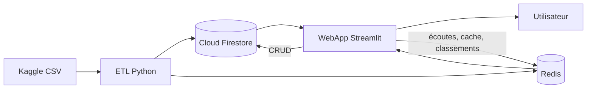

# MusicPulse

Démonstration pédagogique du fonctionnement complémentaire de **Firebase/Cloud Firestore** et **Redis**, à travers un cas d'usage musical développé en Python et Streamlit.

Équipe : **Philippe Maillot**, **Erwan Marchand** et **Evan Afonso**.

## Objectif du TP
Le projet répond à la problématique suivante :

> Comment Firebase et Redis peuvent-ils être combinés pour stocker durablement un catalogue musical tout en fournissant rapidement des classements, des historiques et des recommandations ?

Objectifs pédagogiques :

- modéliser et dénormaliser des documents dans Cloud Firestore ;
- réaliser le CRUD en Python ;
- expliquer les collections, documents, index et règles de sécurité Firebase ;
- manipuler plusieurs structures Redis : String, Hash, List et Sorted Set ;
- démontrer le cache-aside, le TTL, les compteurs atomiques et les classements ;
- comparer une lecture persistante et une lecture servie depuis le cache ;
- importer un dataset volumineux, sauvegarder et restaurer les données ;
- illustrer ces mécanismes avec une WebApp et des analyses musicales.

## Dataset

Source : [Million Song Dataset + Spotify + Last.fm sur Kaggle](https://www.kaggle.com/datasets/undefinenull/million-song-dataset-spotify-lastfm/data).

Profil mesuré sur les fichiers téléchargés :

| Indicateur | Valeur |
|---|---:|
| Morceaux | 50 683 |
| Artistes | 8 317 |
| Interactions utilisateur-morceau | 9 711 301 |
| Utilisateurs | 962 037 |
| Morceaux présents dans l'historique | 30 459 |
| Nombre cumulé d'écoutes | 25 549 912 |
| Maximum d'écoutes pour une interaction | 2 948 |

Problème de qualité principal : **55,91 % de la colonne `genre` est vide**. L'ETL reconstruit donc `primary_genre` à partir du premier tag lorsque le genre est absent.

Le projet contient un échantillon reproductible issu des vraies données. Le ZIP Kaggle complet n'est volontairement pas versionné.

## Architecture



Firestore conserve les documents durables : morceaux, utilisateurs, playlists, favoris et recommandations persistantes. Redis prend en charge les compteurs, classements, dernières écoutes, files d'attente et caches avec TTL.

Le choix **Firebase + Redis a été confirmé par le formateur**.

## Pourquoi utiliser les deux technologies ?

| Besoin | Cloud Firestore | Redis |
|---|---|---|
| Persistance durable | Oui | Secondaire selon la configuration |
| Modèle principal | Collections et documents JSON | Clés et structures en mémoire |
| Lecture très rapide | Correcte, avec index | Excellente |
| Expiration automatique | Non native pour le cache applicatif | Oui, avec TTL |
| Classements | Agrégations ou documents calculés | Sorted Sets |
| Dernières écoutes | Documents ou sous-collections | Lists |
| Compteurs | Écritures atomiques possibles | `INCR` / `HINCRBY` |
| Sécurité utilisateur | Firebase Authentication et règles | Réseau privé, mot de passe, ACL et TLS |

Firestore constitue la **source de vérité**. Redis est une couche rapide et temporaire qui évite de relire inutilement Firestore et fournit des opérations spécialisées.

## Modélisation Firestore

Exemple de document `tracks/{track_id}` dénormalisé :

```json
{
  "track_id": "TRIOREW128F424EAF0",
  "name": "Mr. Brightside",
  "artist": "The Killers",
  "primary_genre": "rock",
  "year": 2004,
  "energy": 0.918,
  "danceability": 0.355,
  "artist_normalized": "the killers"
}
```

Collections prévues :

- `tracks` : catalogue et caractéristiques audio ;
- `users` : profils et préférences ;
- `users/{id}/playlists` : playlists d'un utilisateur ;
- `users/{id}/favorites` : favoris ;
- `recommendations` : résultats persistants ;
- `public_stats` : agrégats précalculés pour le tableau de bord.

La dénormalisation évite des jointures coûteuses : le nom de l'artiste et le genre principal sont directement présents dans un document morceau. Les index composés fournis couvrent notamment `primary_genre + year` et la recherche normalisée par artiste et titre.

## Structures Redis démontrées

| Clé | Type | Usage |
|---|---|---|
| `track:{id}:cache` | String JSON | cache d'une fiche avec TTL |
| `track:{id}:stats` | Hash | compteur d'écoutes |
| `user:{id}:recent_tracks` | List | 50 dernières écoutes |
| `user:{id}:queue` | List | file d'attente musicale |
| `ranking:tracks:global` | Sorted Set | classement des morceaux |
| `ranking:artists:global` | Sorted Set | classement des artistes |
| `recommendations:user:{id}` | String JSON | recommandations mises en cache |

Flux **cache-aside** présenté à l'oral :

1. l'application cherche `track:{id}:cache` dans Redis ;
2. en cas de cache miss, elle lit le document dans Firestore ;
3. elle place le résultat dans Redis avec une durée d'expiration ;
4. les lectures suivantes sont servies par Redis ;
5. après expiration ou modification, le cache est reconstruit.

## Lancement rapide en mode démonstration

```powershell
python -m venv .venv
.venv\Scripts\Activate.ps1
pip install -e .
streamlit run app.py
```

Le mode démonstration ne nécessite ni compte Firebase ni serveur Redis. Il utilise `data/sample`.

## Mode connecté

Configuration de démonstration actuellement appliquée :

- projet Firebase : `musicpulse-d3ce9` ;
- Firestore Standard : région `europe-west9` (Paris) ;
- règles de sécurité et deux index composés déployés ;
- 2 000 morceaux de l'échantillon importés dans `tracks` ;
- Redis local protégé par mot de passe et alimenté avec les classements de l'échantillon.

1. Copier `.env.example` vers `.env` et passer `MUSICPULSE_MODE=connected`.
2. Démarrer Redis :

```powershell
docker compose up -d redis
```

Avec le mot de passe du fichier Compose, utiliser :

```text
MUSICPULSE_REDIS_URL=redis://:musicpulse-dev@localhost:6379/0
```

3. Créer un projet Firebase, activer Firestore et déposer la clé de service sous le nom `firebase-service-account.json`.
4. Déployer les règles et index :

```powershell
firebase deploy --only firestore
```

Ne jamais versionner la clé Firebase. Les règles fournies limitent les écritures du catalogue aux comptes portant le claim `admin`.

## Pipeline de données

Les deux fichiers extraits de Kaggle sont `Music Info.csv` et `User Listening History.csv`.

Profiler les données :

```powershell
python scripts/profile_dataset.py --tracks "CHEMIN\Music Info.csv" --history "CHEMIN\User Listening History.csv"
```

Recréer l'échantillon de démonstration :

```powershell
python scripts/prepare_sample.py --tracks "CHEMIN\Music Info.csv" --history "CHEMIN\User Listening History.csv"
```

Importer le catalogue dans Firestore :

```powershell
python scripts/import_firestore.py --tracks "CHEMIN\Music Info.csv"
```

Pour une répétition rapide, ajouter `--limit 5000`.

Alimenter les classements Redis :

```powershell
python scripts/seed_redis.py --tracks "CHEMIN\Music Info.csv" --history "CHEMIN\User Listening History.csv"
```

## CRUD couvert

- Create : ajout d'un morceau ou d'une playlist.
- Read : recherche, fiche morceau, tendances et recommandations.
- Update : modification des métadonnées, notes et playlists.
- Delete : suppression d'un morceau ou d'un élément de playlist.

La classe `FirestoreMusicRepository` centralise les opérations sur les morceaux. L'écran Administration en expose une partie dans la WebApp.

Chaque modification durable est réalisée dans Firestore. Les clés Redis liées au document doivent ensuite être invalidées afin de ne pas servir une ancienne version.

## Démonstration conseillée

L'onglet **Démo live** de la WebApp permet maintenant de réaliser les opérations
Redis sans passer par Redis CLI :

1. choisir l'identifiant d'un morceau présent dans Firestore ;
2. cliquer sur **1 — Vider le cache** ;
3. cliquer sur **2 — Lire le morceau** pour observer un cache MISS servi par
   Firestore ;
4. cliquer une seconde fois sur **2 — Lire le morceau** pour observer un cache
   HIT servi par Redis ;
5. utiliser **3 — Actualiser le TTL** pour montrer l'expiration ;
6. choisir un utilisateur et un nombre d'écoutes, puis cliquer sur
   **Simuler les écoutes** ;
7. montrer le Hash du compteur, la List des dernières écoutes et le Sorted Set
   du classement directement dans l'interface.

Le CRUD durable reste disponible dans l'onglet **CRUD Firestore**. Firebase
Console peut rester ouvert en parallèle afin de montrer le document persistant,
les règles et les index.

## Sauvegarde et restauration

Sauvegarder une collection en JSONL :

```powershell
python scripts/firestore_admin.py backup --collection tracks --file backups/tracks.jsonl
```

Restaurer :

```powershell
python scripts/firestore_admin.py restore --collection tracks --file backups/tracks.jsonl
```

Redis utilise l'append-only file dans Docker. Pour une vraie production, activer un stockage persistant managé, une rotation des sauvegardes et TLS.

## Cas d'usage musical

- morceaux, artistes et genres les plus écoutés ;
- concentration des écoutes ;
- comparaison des caractéristiques audio par genre ;
- recommandation de morceaux proches ;
- analyse de la longue traîne ;
- exploration du comportement d'écoute.

Ces analyses donnent du sens à la démonstration, mais restent secondaires par rapport à l'explication de Firestore et Redis.

## Tests

```powershell
pytest
```

## Livrables restant à relier

- URL du dépôt GitHub : à compléter après publication ;
- URL Trello et répartition des tâches : à fournir par l'équipe ;
- support de présentation : à créer après validation des analyses finales.
